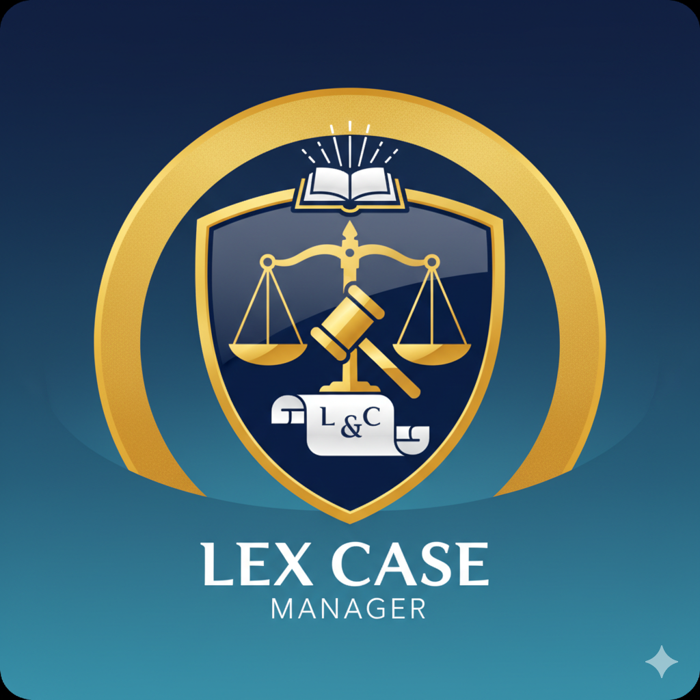

# تطبيق المحامين - مجموعة السيد أسامة القانونية# تطبيق المحامين - مجموعة السيد أسامة القانونية


تطبيق ويب تقدمي (PWA) لإدارة القضايا القانونية والاستقطاعات للمحامين.


تطبيق ويب تقدمي (PWA) لإدارة القضايا القانونية مخصص للمحامين في مجموعة السيد أسامة القانونية.## المميزات


## 🌟 المميزات- تطبيق ويب قابل للتثبيت على الهاتف

- مزامنة فورية مع Firebase

- ✅ **Progressive Web App (PWA)** - يمكن تثبيته على الهاتف كتطبيق أصلي- إحصائيات شاملة للقضايا

- 🔒 **نظام تسجيل دخول آمن** - باستخدام رقم الترخيص ورقم الهاتف- إدارة الاستقطاعات بسهولة

- 📱 **تصميم متجاوب** - يعمل على جميع الأجهزة (هاتف، تابلت، كمبيوتر)- تحديث حالة القضايا

- 🔄 **تحديث فوري** - البيانات تتحدث في الوقت الفعلي- يعمل بدون إنترنت (offline)

- 🌐 **العمل بدون إنترنت** - يحفظ البيانات محلياً عند انقطاع الاتصال- متجاوب مع جميع أحجام الشاشات

- 🎨 **واجهة باللغة العربية** - مصممة خصيصاً للمستخدم العربي

- 📊 **إدارة القضايا** - عرض، تحديث، وإدارة جميع القضايا## طريقة التثبيت على الهاتف

- 💰 **إدارة الاستقطاعات** - تتبع المدفوعات والاستقطاعات

- 🔍 **البحث والفلترة** - العثور على القضايا بسهولة### للأندرويد:

1. افتح الرابط في متصفح Chrome

## 🚀 التثبيت والاستخدام2. اضغط على القائمة (⋮) في الأعلى

3. اختر "إضافة إلى الشاشة الرئيسية"

### 1. فتح التطبيق في المتصفح4. اضغط "تثبيت"

قم بفتح الرابط التالي في متصفح الهاتف:

```### للآيفون:

https://your-username.github.io/LEX-CASE-main/1. افتح الرابط في متصفح Safari

```2. اضغط على زر المشاركة

3. اختر "إضافة إلى الشاشة الرئيسية"

### 2. تثبيت التطبيق على الهاتف4. اضغط "إضافة"


#### على الأندرويد (Chrome):## التطوير المحلي

1. افتح التطبيق في متصفح Chrome```bash

2. ستظهر رسالة "إضافة إلى الشاشة الرئيسية" أو "تثبيت التطبيق"# استنسخ المشروع

3. اضغط على "تثبيت" أو "إضافة"git clone https://github.com/your-username/lawyer-app.git

4. سيتم إضافة أيقونة التطبيق إلى الشاشة الرئيسيةcd lawyer-app


#### على الآيفون (Safari):# افتح في المتصفح أو استخدم خادم محلي

1. افتح التطبيق في متصفح Safaripython -m http.server 8000

2. اضغط على زر المشاركة (المربع مع السهم للأعلى)# أو

3. اختر "Add to Home Screen" أو "إضافة إلى الشاشة الرئيسية"npx serve

4. اضغط "إضافة"

### 3. تسجيل الدخول
- أدخل رقم الترخيص الخاص بك
- أدخل رقم الهاتف المسجل
- اضغط "تسجيل الدخول"

## 🛠️ التقنيات المستخدمة

- **HTML5** - هيكل التطبيق
- **CSS3** - التصميم والتنسيق
- **JavaScript (ES6+)** - منطق التطبيق
- **Firebase Realtime Database** - قاعدة البيانات الفورية
- **Service Worker** - للعمل بدون إنترنت
- **Web App Manifest** - لتحويل الموقع إلى PWA
- **Font Awesome** - الأيقونات

## 🌐 النشر على GitHub Pages

### 1. رفع المشروع إلى GitHub
```bash
git add .
git commit -m "PWA Enhanced Version"
git push origin main
```

### 2. تفعيل GitHub Pages
1. اذهب إلى إعدادات المستودع في GitHub
2. انتقل إلى قسم "Pages"
3. اختر "Deploy from a branch"
4. اختر "main" branch
5. اختر "/ (root)" folder
6. اضغط "Save"

### 3. الوصول إلى التطبيق
بعد دقائق قليلة، سيكون التطبيق متاحاً على:
```
https://your-username.github.io/LEX-CASE-main/
```

## 📱 متطلبات النظام

### الحد الأدنى:
- **المتصفحات المدعومة:**
  - Chrome 45+
  - Firefox 52+
  - Safari 11+
  - Edge 17+
- **اتصال إنترنت** (للتحديث الأولي وتزامن البيانات)

### للحصول على أفضل تجربة:
- اتصال إنترنت مستقر
- متصفح حديث
- تفعيل JavaScript

## 🔐 الأمان

- جميع البيانات محمية بـ Firebase Security Rules
- تشفير البيانات أثناء النقل (HTTPS)
- تسجيل الدخول بنظام آمن

## 📄 الترخيص

هذا التطبيق مملوك لمجموعة السيد أسامة القانونية.

---

**📞 للاستفسارات:** مجموعة السيد أسامة القانونية